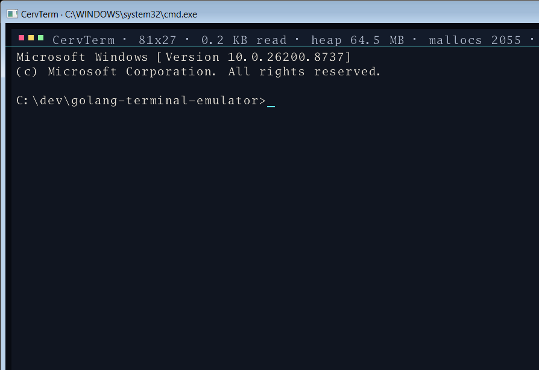

# CervTerm

CervTerm is an experimental GPU terminal emulator written in Go.



## Current status

CervTerm is not a finished daily-driver terminal yet, but it already includes:

- Windows ConPTY backend and Unix PTY backend behind build tags.
- GLFW/OpenGL frontend.
- Scrollback, alternate screen, resize reflow, selection/copy/paste, and bracketed paste.
- VT parsing for common cursor, erase, color, scroll-region, insert/delete, input-mode, mouse-mode, and title sequences.
- Keyboard encoding for navigation keys, F1-F12, and Ctrl/Alt/Shift modifiers.
- SGR mouse press/release/wheel/drag encoding, including modifiers.
- Lua config loading, Teal check/gen support, and `--print-default-config`.
- Renderer-neutral OpenType glyph backend with bitmap color fonts, broad COLRv1 paint/composite/variation support, SVG glyph extraction/rasterization, DirectWrite shaping smoke coverage, and shaped color cluster handling.
- Diagnostics logging via `--log-file` / `CERVTERM_LOG_FILE`, including panic stack capture.
- Parser fuzz smoke coverage and replay-style VT golden fixtures.

See:

- [`docs/product-roadmap.md`](docs/product-roadmap.md)
- [`docs/config-roadmap.md`](docs/config-roadmap.md)
- [`docs/vttest-checklist.md`](docs/vttest-checklist.md)
- [`docs/vttest-captures.md`](docs/vttest-captures.md)
- [`docs/emoji-rendering-research.md`](docs/emoji-rendering-research.md)
- [`docs/shaping-options.md`](docs/shaping-options.md)
- [`docs/release-packaging.md`](docs/release-packaging.md)

## Install beta builds

Tagged releases publish portable zip artifacts from GitHub Actions:

- `cervterm-<tag>-windows.zip` contains the GLFW Windows executable, generated default config, bundled `font-sources/NotoColorEmoji.ttf`, README, CHANGELOG, docs, and packaging metadata.
- `cervterm-<tag>-linux-headless-amd64.zip` contains the headless command for Unix PTY/config/capture smoke coverage before a Linux GUI frontend is packaged.

For a Windows zip install:

1. Download and extract the Windows zip from the GitHub release.
2. Run `cervterm.exe --version` or `cervterm.exe --build-info` to verify the binary.
3. Generate a starter config with `cervterm.exe --print-default-config > cervterm.lua`.
4. Launch with `cervterm.exe --config cervterm.lua`.
5. If diagnosing startup issues, add `--log-file cervterm.log`.

Portable winget manifest templates live under `packaging/winget/`. Authenticode signing and MSI/WiX publishing are intentionally deferred for now; beta distribution uses unsigned portable zips with SHA256 checksums and GitHub provenance attestations.

For release authenticity and unsigned beta expectations, see [`docs/release-trust.md`](docs/release-trust.md). For diagnostics, see [`docs/troubleshooting.md`](docs/troubleshooting.md).

## Build and test

```sh
go test ./...
go test -tags glfw ./internal/fontglyph ./internal/frontend/glfwgl ./cmd/cervterm -count=1
go build -tags glfw -o cervterm.exe ./cmd/cervterm
```

Run the release/package preflight after creating a local beta zip:

```powershell
powershell -NoProfile -ExecutionPolicy Bypass -File scripts/release-preflight.ps1 -Version <tag> -OutDir dist
```

Regenerate the README preview screenshot on Windows:

```powershell
go build -tags glfw -o dist/cervterm-screenshot.exe ./cmd/cervterm
powershell -NoProfile -ExecutionPolicy Bypass -File scripts/capture-cervterm-screenshot.ps1
```

Cross-compile smoke for the non-GLFW headless command:

```sh
GOOS=linux GOARCH=amd64 go build -o dist/cervterm-linux-amd64 ./cmd/cervterm
```

## Run

```sh
./cervterm.exe
./cervterm.exe --version
./cervterm.exe --build-info
./cervterm.exe --print-default-config > cervterm.lua
./cervterm.exe --config path/to/cervterm.lua
./cervterm.exe --capture-vt internal/vt/testdata/manual.vt --capture-program vttest --capture-rows 24 --capture-cols 80
./cervterm.exe --log-file ./cervterm.log
```

## Lua config example

Generate a complete editable template with `--print-default-config`. A minimal example:

```lua
return {
  window = { width = 1100, height = 720, padding_x = 18, padding_y = 44 },
  font = { family = "Go Mono", size = 14 },
  shell = { program = "powershell.exe", args = {} },
}
```

## Teal config

`cervterm.tl` is checked and generated through the external `tl` command before CervTerm loads the generated Lua file. Lua remains the runtime target, so Teal is optional for users who prefer direct Lua config.

## Diagnostics logging

Runtime diagnostics are written to stderr and to a local log file by default. Override the location with `--log-file path/to/cervterm.log` or `CERVTERM_LOG_FILE`; use `--log-file -` to keep diagnostics on stderr only. Unexpected panics are captured with a stack trace before CervTerm exits.

## Known limitations

- DirectWrite shaping is implemented on Windows with Arabic/Indic/emoji smoke coverage; broader real-world fixture coverage is still growing.
- SVG text rasterization has basic layout support; real font selection/outline text remains future work.
- More redistributable color-font fixture subsets are needed for broad cross-platform emoji validation.
- A real MSYS2-built `vttest` startup/menu capture is automated; broader interactive `vttest` menu paths remain future coverage.
- Packaging has CI beta zip artifacts, tag-triggered GitHub release publishing, SHA256 checksums, GitHub provenance attestations, portable winget manifest templates, SVG icon source, generated Windows `.ico`, and CI `goversioninfo` resource embedding for Windows builds. Authenticode signing and MSI/WiX publishing are intentionally deferred.
