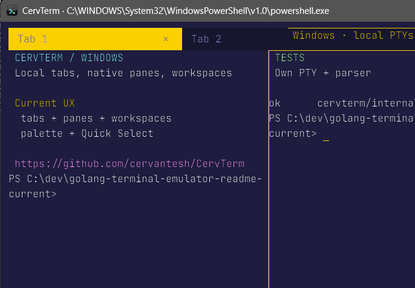
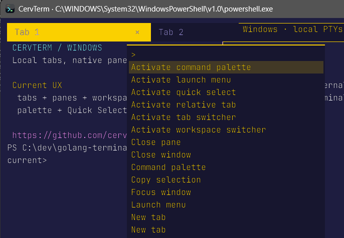
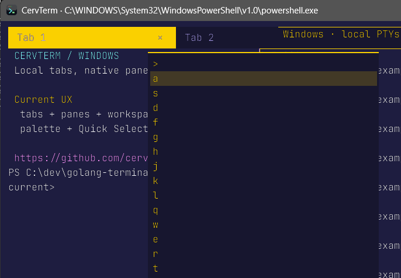

# CervTerm

[](https://github.com/cervantesh/CervTerm/actions/workflows/ci.yml)
[](https://github.com/cervantesh/CervTerm/releases/latest)
[](LICENSE)

CervTerm is an experimental, Windows-first GPU terminal emulator written in Go. It combines a native in-process multiplexer, Lua/Teal configuration, rich font and appearance controls, retained command UX, and a bounded terminal core behind one GLFW/OpenGL frontend.



*Two tabs, two independent local panes, and window-local status on the qualified Windows frontend.*

> **Beta software:** Windows amd64 is the qualified GUI target. Back up important terminal workflows and keep another terminal available. Renderer selection, remote domains, and live session detach/reattach are intentionally unavailable.

## Highlights

- **Independent local panes:** each pane owns its PTY, parser, terminal state, scrollback, focus, geometry, and zoom. Split, resize, move, swap, and close panes without rebuilding sibling state.
- **Visible tabs, native windows, and workspaces:** retained tab bar, multiple process-owned windows, named local workspaces, cross-window pane/tab movement, and optional layout-only persistence.
- **Terminal behavior:** scrollback and reflow, alternate screen, selection, bracketed paste, keyboard/mouse protocols, search, BiDi opt-in, OSC 7 working directory, OSC 8 hyperlinks, OSC 52 policy, semantic shell zones, bells, and notifications.
- **Modern configuration:** strict v2 documents, includes, environments, profiles, CLI overrides, provenance diagnostics, Lua modules, Teal generation, graph-wide watching, atomic activation, and failed-edit recovery.
- **Typed actions and retained UX:** leader chords, key tables, exact mouse bindings, command palette, Quick Select, launch menu, tab/window/workspace actions, and Lua callbacks with watchdogs.
- **Fonts and appearance:** ordered descriptors and fallback rules, ligatures/features, fixed-grid metrics, bitmap/COLR/SVG color glyphs, DirectWrite shaping/raster support, per-side padding, independent opacity controls, layered backgrounds, native blur capability, tab bar, and scrollbar policies.
- **Bounded experimental graphics:** independent default-off Kitty, Sixel, and iTerm inline-image subsets sharing explicit pane/process budgets and the existing OpenGL renderer.
- **Diagnostics and hardening:** `--doctor`, `--explain-config`, structured logs, panic capture, race coverage, fuzz smoke, replay fixtures, recovery gates, checksums, and GitHub provenance attestations.

### Command palette



Search built-in typed actions and labeled user bindings without sending modal input to the shell.

### Quick Select



Label visible links and configured matches while preserving pane, viewport, and output identity.

## Platform status

| Platform | Status |
| --- | --- |
| Windows amd64 | Qualified beta GUI using GLFW/OpenGL and ConPTY. Release zip available. |
| Linux amd64 | Headless release artifact. A narrow source-built WSLg/X11 GUI integration pass exists, but broad desktop support is not claimed. |
| macOS | Headless compile evidence only; no packaged or qualified GUI. |

See the machine-readable [support matrix](docs/parity-support-matrix.json) and [Phase 15 platform qualification](docs/validation/phase-15-platform-qualification.md) for exact evidence and exclusions.

## Install a Windows beta

1. Download `cervterm-<tag>-windows.zip` and `SHA256SUMS.txt` from the [latest release](https://github.com/cervantesh/CervTerm/releases/latest).
2. Verify the archive:

   ```powershell
   $archive = "cervterm-<tag>-windows.zip"
   $expected = ((Select-String -Path .\SHA256SUMS.txt -Pattern ([regex]::Escape($archive))).Line -split "\s+")[0]
   $actual = (Get-FileHash ".\$archive" -Algorithm SHA256).Hash.ToLowerInvariant()
   if ($actual -ne $expected.ToLowerInvariant()) { throw "SHA256 mismatch" }
   ```

3. Extract the zip and inspect the build:

   ```powershell
   .\cervterm.exe --version
   .\cervterm.exe --build-info
   .\cervterm.exe --doctor
   ```

4. Generate and edit a v2 configuration, then launch:

   ```powershell
   .\cervterm.exe --print-default-config > cervterm.lua
   .\cervterm.exe --config .\cervterm.lua
   ```

Beta binaries are currently unsigned. Releases include SHA256 checksums and GitHub provenance attestations; winget files are templates rather than a published package, and MSI/WiX publishing is deferred. Read [release trust](docs/release-trust.md) before distribution.

## Configuration v2

A compact starting point:

```lua
local cervterm = require("cervterm")

return {
  config_version = 2,

  window = {
    initial_rows = 30,
    initial_cols = 100,
    decorations = "system",
    titlebar = "dark",
    padding_left = 8,
    padding_right = 8,
    padding_top = 8,
    padding_bottom = 8,
  },

  font = {
    family = "JetBrainsMono Nerd Font",
    size = 12.0,
    ligatures = true,
  },

  colors = {
    foreground = "#F7F7FB",
    background = "#1E1D40",
    cursor = "#FAD000",
    accent = "#FAD000FF",
  },

  tab_bar = { mode = "multiple", position = "top" },
  scrollbar = { mode = "scrolling", stable_gutter = true },

  keys = {
    { key = "t", mods = "ctrl+shift", label = "New tab",
      action = cervterm.action.NewTab },
    { key = "p", mods = "ctrl+shift", label = "Command palette",
      action = cervterm.action.ActivateCommandPalette },
    { key = "q", mods = "ctrl+shift", label = "Quick Select",
      action = cervterm.action.ActivateQuickSelect },
  },
}
```

The generated template documents common settings. The public schema also includes composition and persistence fields that are intentionally not expanded inline; consult the detailed configuration references below. V2 can compose local sources with `includes`, select declared `environments` and `profiles`, and apply repeatable typed CLI overrides:

```powershell
.\cervterm.exe --config .\cervterm.lua `
  --config-override window.background_opacity=0.94
.\cervterm.exe --config .\cervterm.lua --explain-config
.\cervterm.exe --config .\cervterm.lua --explain-config-field font.family
```

Use `--environment <name>` or `--profile <name>` only after declaring that name in the configuration graph; unknown selections fail closed.

CervTerm watches the complete active source graph, including discovered local Lua module dependencies. Reload with `Ctrl+Shift+R` or `term:reload_config()`. Invalid edits preserve the active runtime and remain watched for automatic recovery. Application scope is explicit: some fields are live, shell changes apply to new panes, geometry may apply to new windows, and resource changes require restart.

See [getting started](docs/getting-started.md), [configuration compatibility](docs/config-compatibility-policy.md), and [scripting/actions](docs/scripting.md).

## Default shortcuts

Lua bindings override ordinary built-ins. Active retained modes and reserved search/reload routes run first.

| Shortcut | Action |
| --- | --- |
| `Alt+Shift+=` / `Alt+Shift+-` | Split the focused pane right / below |
| `Alt+Arrow` | Focus the nearest pane geometrically |
| `Ctrl+Shift+W` | Close the focused pane, or the final window |
| `Ctrl+=` / `Ctrl+-` / `Ctrl+0` | Zoom only the focused pane / reset zoom |
| `Ctrl+wheel` | Zoom only the focused pane |
| `Ctrl+Shift+F` | Open scrollback search |
| `Ctrl+Shift+R` | Atomically reload configuration |
| `Shift+PageUp/PageDown` | Scroll one page |
| `Shift+Home/End` | Scroll to history start / live bottom |
| `Ctrl+V` or `Shift+Insert` | Paste clipboard |
| `Ctrl+Insert` or `Ctrl+Shift+C` | Copy selection |
| `Ctrl+Shift+I` | Toggle render statistics |

Drag a divider with the left mouse button to resize adjacent panes. Tabs, windows, workspaces, command palette, Quick Select, and launch menu are typed actions but do not claim default chords; bind only the ones you want.

## Tabs, windows, workspaces, and persistence

The default tab bar mode is `multiple`, so it appears when a second tab opens. `always` and `hidden` are also available. Tabs and panes can move between process-owned native windows while retaining stable process-local identities.

Named workspaces change which local windows are visible; switching does not suspend their sessions. Optional persistence saves bounded layout metadata only. Restore creates fresh local shell processes—it does **not** preserve or reattach live processes. Remote SSH/WSL domains and live detach/reattach are excluded.

## Shell integration and trusted effects

CervTerm recognizes OSC 7 working directories, OSC 8 hyperlinks, OSC 133/633 semantic prompt zones, bounded notification sequences, and bell policies. Detected links require a fresh user click and an allowed HTTP(S) target before the platform opener runs. OSC 52 terminal writes default to `off`; reads are denied.

Windows native notifications are experimental, consent-gated, and disabled by default. When enabled, terminal-supplied notification titles and bodies are intentionally delivered to the native notification adapter; configuration diagnostics and fallback errors remain value-redacted.

## Experimental opt-ins

These features are disabled by default, restart-scoped, and do not carry broad support claims:

| Feature | Current boundary |
| --- | --- |
| Windows IME/preedit | Experimental native composition path. Broader real Japanese/Chinese/Korean qualification remains incomplete. |
| Windows UI Automation | Experimental visible-viewport projection only. Narrator/NVDA support is not claimed. |
| Kitty graphics | Bounded direct-data subset; independent flag and rollback. |
| Sixel graphics | Narrow 7-bit DCS subset with explicit grammar and budgets. |
| iTerm inline images | Narrow inline PNG subset; Windows/OpenGL visual evidence exists. |

Example graphics opt-in:

```lua
return {
  config_version = 2,
  graphics = {
    kitty = { enabled = false },
    sixel = { enabled = false },
    iterm = { enabled = true },
  },
}
```

Operational rollback is independent: disable the affected protocol and restart. External file/URL transports, animation, broad Sixel scrolling/cursor behavior, and full protocol conformance are excluded.

## Known limitations and non-goals

- GLFW/OpenGL is the only GUI renderer; selectable rendering backends are excluded.
- Windows is the only packaged and qualified GUI platform.
- No SSH/WSL domains, tmux integration, or live detach/reattach.
- Layout persistence restores fresh processes rather than live sessions.
- Native blur is capability-dependent and degrades when unsupported or incompatible.
- IME, accessibility, notifications, and inline graphics remain experimental/default-off where noted.
- Broader installed-font, DirectWrite shaping, SVG text, color-font fixture, and interactive `vttest` qualification continues.

## Build and test

Requirements: use the exact Go version declared by `go.mod` (currently Go 1.25.8). Windows GLFW builds require a working C toolchain. Source-built Linux GUI work additionally requires the distribution equivalents of the GLFW, OpenGL, and X11 development headers. Run maturity gates only from a clean, full-history checkout.

```sh
go test ./...
go test -tags glfw ./internal/fontglyph ./internal/frontend/glfwgl ./cmd/cervterm -count=1
go run ./scripts/check-maturity-gates.go
go build -tags glfw -o cervterm.exe ./cmd/cervterm
```

Package and validate a local beta:

```sh
go run ./scripts/package-beta.go -version <tag> -outdir dist
go run ./scripts/release-preflight.go -version <tag> -outdir dist \
  -windows-zip dist/cervterm-<tag>-windows.zip
```

The Linux release artifact is currently headless:

```sh
GOOS=linux GOARCH=amd64 go build -o dist/cervterm-linux-amd64 ./cmd/cervterm
```

## Documentation

- [Getting started](docs/getting-started.md)
- [Scripting and typed actions](docs/scripting.md)
- [Configuration roadmap](docs/config-roadmap.md)
- [WezTerm parity roadmap](docs/wezterm-parity-roadmap.md)
- [Support matrix](docs/parity-support-matrix.json)
- [Architecture](docs/architecture.md)
- [Manual verification](docs/manual-verification.md)
- [Troubleshooting](docs/troubleshooting.md)
- [Release packaging](docs/release-packaging.md)
- [Release trust](docs/release-trust.md)
- [Support policy](SUPPORT.md)

## License

See [LICENSE](LICENSE).
